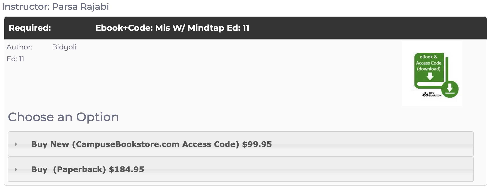

# Course Syllabus

**BUS 160/CIS 110: Computerized Business Applications and MIS (3)**

---
**Fall 2024**

- **Section BUS 160 ON1 [CRN 90141]**
  - Thursdays, 8:30-11:20, via Zoom
- **Section CIS 110 AB6 [CRN 90272]**
  - Thursdays, 11:30-14:20, [hybrid](schedule.md) in Building D, Room 223 (Abbotsford Campus)
- **Section BUS 160 AB6 [CRN 90139]**
  - Thursdays, 16:00-18:50, [hybrid](schedule.md) in Building D, Room 204 (Abbotsford Campus)

---
## Course Instructor

**Name:** Parsa Rajabi

**Email:** parsa.rajabi [at] ufv [dot] ca

**Office Hours:** Thursdays, 14:30-15:30, Building C, Room 2456 (Abbotsford Campus) + via Zoom

Zoom appointments can be made by email request (a minimum of 24 hours in advance). Request for appointments with less than 24 hours notice may not be accommodated.

**All inquiries should be sent to the instructor via email. Blackboard Messages are NOT monitored/answered**

Note: When emailing, please include the following in your email:

- Subject: `[CIS 110/BUS 160 + Section] - Your Subject`
- In the body, include your full name, student ID, and your inquiry.

### Professionalism 

Students are expected to maintain a high level of professionalism in all course activities and communication with the instructor and peers. This includes proper email etiquette, respectful communication in class, and adherence to deadlines. Before sending an email, please ensure that you have included a subject line, a greeting, a clear message, and a closing. Using AI/ChatGPT to generate emails is not recommended and such emails will be returned for revision.

Before sending an email, make sure to review this article on [How to email your profs effectively](https://students.ubc.ca/ubclife/inbox-1-email-profs-effectively) for tips on how to effectively communicate with your instructor. Emails that do not follow these guidelines will be returned to the sender for revision.

Repeated unprofessional behavior will result in grade deduction from your final grade, with each violation resulting in a 1% deduction. Students will be notified of possible deductions after the first warning.

## Lab Monitors

### Sections BUS 160 ON1 + BUS 160 AB6
**Name:** Navneet Jhangra

**Email:** navneet.jhangra [at] student.ufv [dot] ca

### Section CIS 110 AB6

**Name:** Aastha Anand

**Email:** Aastha.Anand [at] student.ufv [dot] ca

### Weekly Module Tests (Flipped Classroom) 

This course will be taught using a pedagogical technique known as the Flipped/Hybrid classroom.  This approach makes the most of our precious class time by eliminating the standard lecturing model, where course material is introduced to the students during class, usually via a lengthy PowerPoint presentation.  In our Flipped/Hybrid classroom, you will come to class having already completed several module tests (and videos) where you will be introduced to the course material.  During class, you will apply your understanding of these core concepts through carefully-chosen problems and activities, which will enable you to solidify your knowledge.  

Flipped/Hybrid classrooms require much more focus and preparation time, for both the instructor and the students.  After all, it is much easier for the instructor to read a set of pre-prepared slides and for the students to passively observe and listen.  But in our class, we will devote our class time to the computational thinking process: resolving obstacles, developing conceptual understanding, communicating solutions supported by evidence, and creating efficient algorithms that solve our problem.  Through this process, you will better develop your confidence, creativity, and critical-thinking skills, preparing you to become a successful problem-solver in the real world.

In order for this course to be a meaningful learning experience, you will need to come to each class well-prepared, with all assigned modules and videos complete.  This emphasis on pre-class work is the reason why our class meets every other week. If you do not complete the pre-class work, you will have a hard time following the in-class activities, which will make it that much harder for you to successfully complete the course deliverables.

I have designed this course so that you will be spending approximately 9 to 12 hours per week on all activities relating to this course (i.e., pre-class work, attending class, all assessments).

## Classroom Etiquette

The classroom principles that we will follow in the classroom are transparency, equity and inclusion, participation, active dialog, and constructive critique. Students are expected to support each other, learn from each other, and help each other grow. Students have the responsibility to conduct themselves in ways that will help them learn, yet that will not disrupt other students’ learning. While each student will be working closely with their team members, you are also expected to engage with your classmates in a respectful, kind, and helpful manner.

In the class, we encourage asking questions, sharing ideas, and engaging in discussions related to the class topics. Sometimes discussions may steer away from the course content, and the course instructor will reserve the right to re-direct it back on track.

Giving and receiving feedback is one of the core activities in this class. When giving and receiving feedback, it is important to keep in mind that we give feedback because we want all students to succeed. Our feedback will highlight parts that work well but also point out aspects that can be improved. The feedback should not be taken personally or seen as an attack on students' knowledge or capabilities. Thus, we will learn a craft of constructive feedback and practice it in the class regularly.

## Course Description

The [UFV calendar description](https://www.ufv.ca/calendar/current/CourseDescriptions) of this course is:

> This course covers understanding, application, and advanced skill development in spreadsheets, databases, presentation software, and word-processing, integrated with an introduction to Management Information Systems (MIS). Emphasis is on problem solving and integration of software applications within a MIS context.
>
> Note: This course is offered as CIS 110 and BUS 160. Students may take only one of these for credit.
>
> Prerequisite(s): None. It is recommended that students are competent in computer skills
> Corequisite(s): None.
> Pre- or corequisite(s): None.

## Learning Outcomes

The Learning outcomes for this course are:

1. Demonstrate the sophisticated skills in word processing, spreadsheet and database application, and presentation creation.
2. Apply professional principles and practices (i.e., privacy, ethics, equity) to data management and sharing.
3. Use file management systems for data organization, information retrieval, backup, and recovery.
4. Incorporate software applications to effectively address and resolve business challenges, with a specific focus on Indigenous contexts and data, such as those related to Indigenous population dynamics, education, and facility development.

## Required Textbook Material

> [!WARNING]
> You will not be able to complete this course with another section's textbooks as they differ. Make sure to select the correct course/section  and see "Parsa Rajabi" as instructor.

MIS 11 (11th Edition) by Hossein Bidgoli 

## Course Evaluation

|      **Item**       | **Weight** |
| :-----------------: | :--------: |
| Weekly Module Tests |    15%     |
|     Assignments     |    25%     |
|       Quizzes       |    30%     |
|   Final Component   |    30%     |

### Letter Grade Conversion

## Passing Criteria

Students must attain an overall passing grade (50% or higher) on the weighted average of quizzes and final component in the course to obtain a clear pass (C- or better).

## Course and Policies

### Late Policy and Missed Items

Course elements such as assignments and module tests can be submitted up to 24 hours after the due date with a 25% penalty. After 24 hours, the submission will not be accepted and a score of zero will be assigned.

Make-up assessments (including assignments, exams and quizzes) will not be given. Sometimes life gets in the way of schedules. Sickness or other unplanned or extraordinary events happen and will be dealt with individually. It is your responsibility to ensure your situation is known to the instructor as soon as reasonably possible. You are accountable for being heard, which means you need to ensure that the instructor heard you.
 
While "life happens," poor planning by you does not count. And definitely do not wait to discuss gray areas. For example, an interview opportunity arises (good!): you should not wait until the day before the assignment is due to let us know that you could not complete the assignment because you had to prepare for the interview. That would be considered poor planning. Good planning would be to alert the Lab Monitor or Instructor that you got the interview and, while you hope to finish the assignment, there is a concern. Then when you don’t finish on time, it’s clear that you planned your time and that will be taken into consideration. These "good planning" situations will be considered individually as per the instructor's discretion.

In all cases, exceptional situations are considered on an individual basis, subject to the approval of the instructor and supported by legitimate and verified documentation. 

### Remarking Policy

As a teaching team, we strive to provide fair and accurate assessments of your work while also providing as much feedback. We encourage you to review the feedback and spend your time/energy where it serves you the most which will be learning from past mistakes and self-improvement. While you reserve your right to ask for a re-grade, we find debating grades an incredible drain on course staff time and energy and prevents us from serving students well and focusing on most important aspects of the course. 

If you feel a course item has been incorrectly assessed you may request that the item be remarked. However, before making a remarking request, please complete the following steps:

1. Review the marking rubric and feedback/comments (if applicable).
2. Schedule a meeting with the instructor to discuss the feedback and marking.
3. If you still feel the marking is incorrect, you may request a re-marking.

#### Request a Remarking

Requests must include a written letter for the re-marking and be submitted to the course instructor within 5 business days from receiving the mark or a deadline specified by the instructor, whichever comes first. The request must be signed and submitted via email. 

Course grades are considered final on a rolling basis (e.g. as we progress through the semester). After the regrading request deadline (e.g., 5 business days or deadline set by instructor), grades will be considered final and no further requests will be accepted. Students are encouraged to review their grades and ask questions within the specified time frame. Inquiries after the deadline will not be considered.

The re-marking request will be reviewed by the teaching team and if accepted, the item will be re-marked in its entirety by both the course instructor. This may result in a higher, unchanged, or lower mark overall which will be final. 

### Academic Integrity

Academic Integrity is important to me and I know it is to most students. Cheating is never worth the risk to your personal and professional reputation. I expect students to be truthful and honest in their work. This means that any work you submit for individual evaluation should be yours alone and that you recognize the work of others if you use their ideas, thoughts or material. The assignments have been designed to ensure that you learn the material. I ensure that all students are graded fairly and will take action against students who violate the academic dishonesty policy. Students who engage in any acts of falsification, misrepresentation, or deception will face penalties for violating UFV policy, which can include failure in the assignment and/or a FD-Failed for Discipline grade on your transcript. Listed below are some examples of academic dishonest behavior that will result in a grade penalty:

#### Plagiarism

This refers to passing off the work of another as your own. Make sure to cite all your sources if you incorporate the words or ideas of another person. This includes sources from books, journals, the internet, emails, live presentations (e.g. speeches) and even relevant conversations with other people. You can avoid plagiarism by appropriate citation and referencing in your papers, projects and presentations.

#### Inappropriate use of technology in coursework

The use of technology to produce content for your assignments that is not specifically listed in the syllabus as permissible is strictly prohibited. All submissions for grading must be your own work. This specifically includes a prohibition on artificial intelligence writing software such as ChatGPT and translation software as it will interfere with the learning objectives outlined for this course.

#### Collusion / Unauthorized Collaboration

You are expected to complete all assignments for this course on your own. When assigned individual work, it is unfair to collaborate and gain an unfair advantage over your classmates who complete their work on their own. Collusion includes sharing homework, quiz or test questions and answers with other students. Examples of collusion:

- Working on answers with a friend for a homework assignment or during an open book exam
- Using “tutoring websites” (e.g. Chegg.com, CourseHero) to find answers to assignment/ exam questions
- Assisting others to cheat by answering questions that are posted to a FB/ WhatsApp group
- Falsifying/ fabricating information

**Do not misrepresent yourself or your work.** The following are examples of prohibited behavior:

- Making up sources or facts
- Misrepresenting your identity by asking someone else to complete any portion of a course (i.e. make comment on a discussion board, i-clicker quiz, exam)
- Falsifying or altering any documentation required by the University, including (but not limited to) doctors note’s in order to gain an academic advantage

#### Unauthorized use of note-sharing websites

You may come across websites that claim to help students by providing answers to test questions and encourage students to upload your instructor’s copyrighted material (e.g. lecture slides, exam questions, etc.) Sharing exam/assignment questions is strictly prohibited as this material is the intellectual property of the instructor and should not be shared in any format. Furthermore, beware of uploading your own completed assignments as you could be assisting other students to cheat using your material. Assisting others to cheat is strictly prohibited in the UFV student academic integrity policy.

Note sharing sites expect their users to comply with the Honour Code of their organization. Their own policy mandates that they cooperate with an investigation of academic dishonesty. The UFV Academic Integrity Office routinely monitors these sites for evidence of cheating and will initiate discipline proceedings against students who violate the UFV Student Academic Integrity policy.

#### Unauthorized use of tutors / editors

If you plan to use a tutor/editor, be aware that any work that you submit must always be your own. An ethical tutor will always focus on explaining concepts so that you can become an independent learner. You are violating the student academic integrity policy if:

- A private tutoring company coaches you on how to complete an assignment
- You buy / sell/ swap assignment questions and answers on social media platforms like WeChat, Whatsapp, Facebook, etc.
- Your use an editor (paid or unpaid) without permission of the instructor to revise, correct or alter your work

## First Class Attendance

As per [UFV Policy 62](https://www.ufv.ca/media/assets/secretariat/policies/Attendance-(62).pdf): Students must attend the first day of class and complete the activity as assigned by the instructor in order to keep their seat in the course.  Failure to do this may result in an automatic withdrawal and students on the registered class waitlist who are in attendance will be given your spot. If you are unable to attend the first day of class, please contact the instructor in advance to make alternate arrangements.