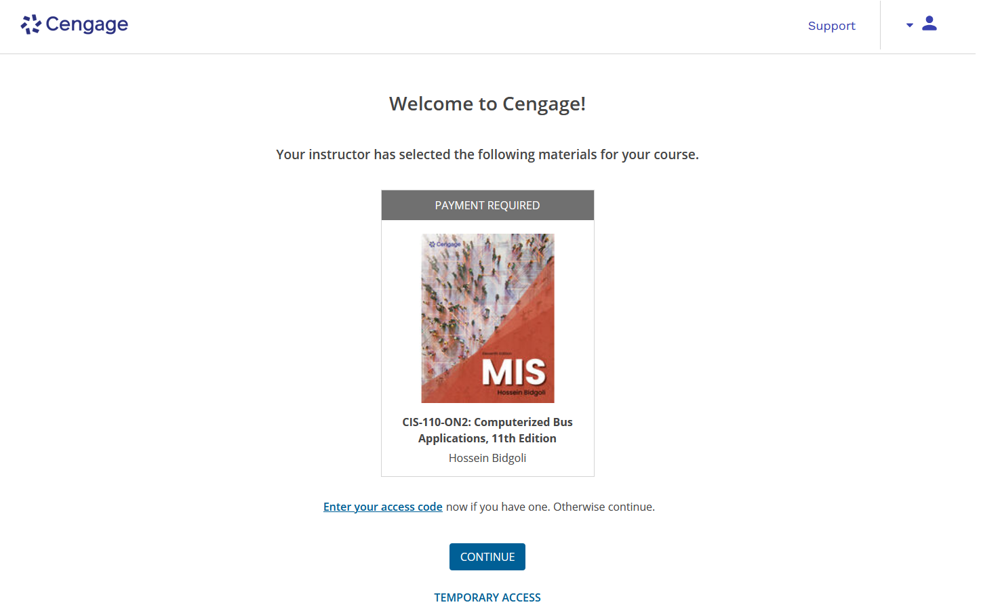

# Cengage Textbook Setup

Here are the steps to set up your Cengage MindTap account and access the course materials.

1. Purchase the Cengage MindTap access code from the UFV bookstore or online. You can find the link via the course [syllabus](syllabus.md#required-textbook-material)
2. After purchasing the access code, you will receive 2 emails
    - [A] One from the bookstore that confirms your purchase was successful with an order number at the top
    - [B] The second email will be a Digital Item Redemption email that contains a redemption code and a link to redeem your code
3. Click on the link in the email (email [B]) to redeem your code. This will take you to a code redemption page with the information already pre-populated
    - Click on the "I agree" button to accept the terms and conditions
    - Click on the "Redeem Product" button to redeem your code
    - You may need to create an account if you don't already have one. Make sure to use your UFV email address when creating your account.
4. You will then receive a third email that contains your Cengage MindTap account information and access code 
    - This access code starts with the letter "P" and is 14 characters long
    - Note this code down, as you will need it in a few steps

> [!WARNING]
> While the email that you receive may say "ask the instructor for course key", this is not necessary. Instead, follow the steps below to set up your Cengage MindTap account and access the course materials.

5. Open a new tab on your browser and navigate to [D2L Brightspace](https://ufv.brightspace.com/)
   - Navigate to the course page for this course
6. On the left navigation bar, click on the "Module Tests" tab 
7. Click on the link for the first module test (e.g. "Module Test - Word 1-5")
8. Wait for the page to load, and then click on the "Launch Cengage MindTap" button (this may also automatically redirect you to the Cengage MindTap page)
9. If you already have a Cengage MindTap account, you will be prompted to log in. (You may have had one from a previous course). If not, click on "Create an Account" to create a new Cengage account
   - **Important: make sure to use your UFV email address when creating your account**
   - If you create a new account, you may need to activate your account (you will receive an email from Cengage with a link to activate your account - this is different from the email/code you received from the bookstore)
10. After you have logged in or created your account, you will be taken to the Cengage MindTap page for this course as shown below

11.  Click on "Enter your access code" and enter the access code you received in the email from Cengage (Step #4), this code starts with the letter "P" and is 14 characters long
12.  You will then be taken to the Cengage MindTap page for this course.
13.  Congratulations! You have successfully set up your Cengage MindTap account and can now access the course materials. Celebrate your success by grabbing a snack or drink of your choice. 🎉

> [!NOTE]
> Still having trouble? Contact our course lab monitor who will be available during the drop-in sessions. Details on how to book a session are available on the [course home page](home.md#drop-in-help)